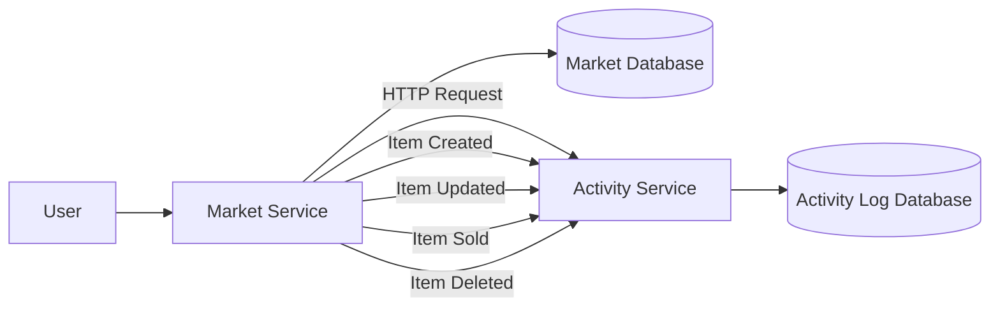
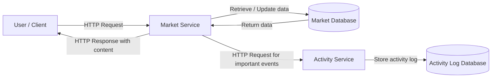

# Introduction:

This project is a simplified buying and selling marketplace, inspired by platforms such as eBay. The first version focuses on core CRUD functionality, allowing marketplace items to be created, viewed, updated, deleted, and marked as sold. The project is intentionally designed to be simple at first, while leaving room for future features such as user accounts, seller profiles, categories, search, payments, reviews, and order history.

The system is split into two backend services. The Market Service manages marketplace items and handles the main buying and selling actions. The Activity Service records important events that happen in the marketplace, such as when an item is created, updated, bought, or deleted. In the first version, these services communicate using HTTP requests. Later, this communication could be replaced with a more advanced event-driven approach using a message broker such as RabbitMQ or Kafka.

The application uses a relational database structure. Data is separated into tables to reduce duplication and improve organisation. For the initial version, the Market Service stores item data, while the Activity Service stores activity log data. As the project expands, additional tables could be added for users, sellers, buyers, categories, orders, payments, and reviews.

## What it is:

A multi service system

2 applications: Market service handles item listings and buying/selling applications, Activity service handles recording of events in the marketplace and has the activity log database 

## Flow:

Now - Market Service -> HTTP request -> Activity Service

Later - Market Service -> message queue -> Activity Service

## High-Level System Flow:

## Example database tables:

### User

- id
- name
- email
- password
- role
- created_at

### SellerProfile

- id
- user_id
- username
- bio
- rating
- created_at

### Item

- id
- seller_id
- title
- description
- price
- status
- created_at

### Order

- id 
- buyer_id
- item_id
- total_price
- status
- created_at

### ActivityLog

- id
- event_type
- item_id
- message
- created_at

## Relationships:

A SellerProfile must belong to exactly one User

A User can be a Seller. 

A Seller can list many Items.

A Buyer, who is also a User, can create an Order.

An ActivityLog records things that happen to Items.

## Milestones:

Milestone 1: Add SQLite Database to Market Service

Milestone 2: Update Tests for the Database Version

Milestone 3: Create the Activity Service for recording events that happen in marketservice

Milestone 4: Add ActivityLog Table and Endpoints - Give the Activity Service an actual database table for recording marketplace events.

Milestone 5: Make the Market Service tell the Activity Service when important events happen.

Milestone 6: Add docker files

Milestone 7: Replace SQLite with PostgreSQL

Milestone 8: Automatically run tests whenever you push to GitHub.

Milestone 9: Add users and seller profiles

Milestone 10: Add order functionality

Milestone 11: Improve frontend

Milestone 12: Put in cloud